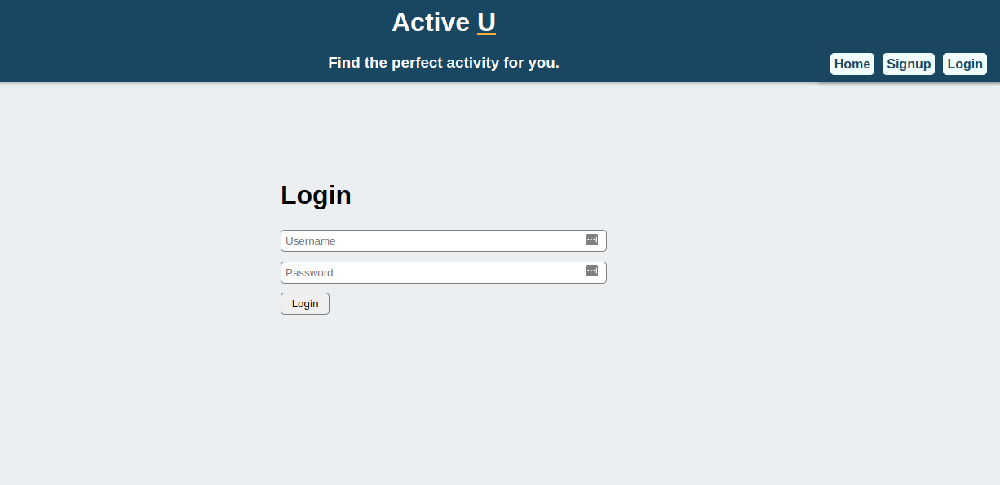
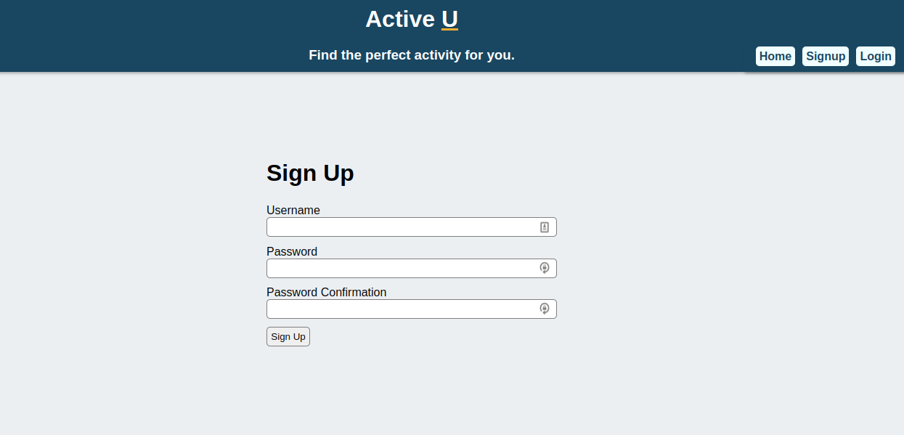
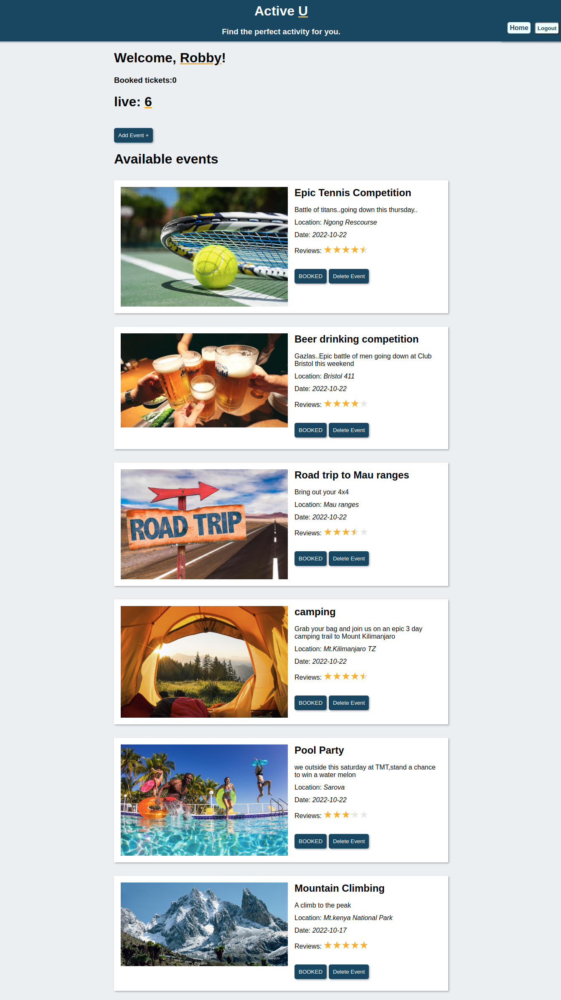

# Active-U web application 1.0

​
live link:https://active-u-app.herokuapp.com/signup
​

## Authors:

​

- Evans Rutto
- Julius Wandera
- Wandia Mugo
- Gitau Elvis
- Nicholas Kamau
  ​
  ​

## Problem statement

​

- Have you ever experienced those long boring weekends, just don't know what to do or where to go yet Monday is fast approaching..? I don't know about you, but I have. This is definitely a common issue and needs a quick solution.
  ​
  What if we had an application that shows you all the awesome events around from parties and road trips to camping and formal events.
  ​
  ##Solution
  ​
  introducing Active U. A web application that lets you view all events around you, Create a new event, book an event and leave a review.

## Technology used

-Active u is built using a combination of React and JavaScript for the Front-end development, while Ruby on rails for back-end development.
​
​

### Screenshot

​



​
​

## setup/installation

​

- To have this project up and running in your development environment,the steps are well detailed below.
  ​
  1.clone the following repos into your pc.
  ​
- Back end ruby project
  ​

https://github.com/robbyevans/Final-Active-U-APP
​
2.open the repository containing the files cloned in your code editor .
​
3.While in your code editor,open terminal and run the command:

```bundle install```

```npm install --prefix client```

```rails db:migrate db:seed```

-to open backend API

```rails s```

-to launch the front-end react

 ```npm start --prefix client```
​
​
- This will install the necessary dependancies,perform migration and load the local server respectively.
​
- However this project is hosted inheroku and the live link is:
https://active-u-app.herokuapp.com/login
​
​
## contact and Support
​
## license
​
This project is not covered by any license and is open source
